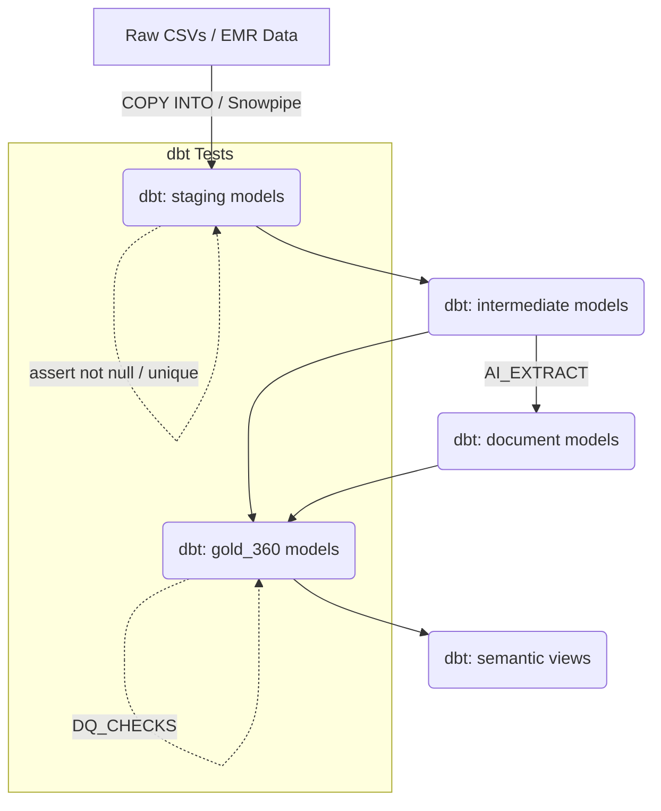

# High-Level Design (HLD) & Implementation Plan: Post-Demo Refactoring (dbt Migration & CoCo CLI Removal)

## 1. System Overview
Currently, CareLens 360 uses a bash script (`run.sh`) to execute sequentially numbered SQL files (`00` to `07`). It also heavily relies on CoCo CLI (`.cortex/` directory, `phi-guard`, `evidence-auditor`, hooks) for constraints and auditing.

In the next phase, we will:
1. Transition the transformation and testing layers (`01` through `04`) into **dbt (Data Build Tool)**.
2. **Remove the CoCo CLI dependency entirely**, moving required checks and logic to standard CI/CD pipelines and dbt tests.

### Scope Boundaries
dbt is excellent at data transformation (the "T" in ELT) but is not an infrastructure-as-code tool. We must draw clear boundaries:
* **IN SCOPE for dbt:** 
  * `01_load_structured`: Table models and data quality checks (converted to `dbt test`).
  * `02_documents`: Document metadata, chunking logic, and `AI_EXTRACT` models.
  * `03_gold_360`: Patient 360, risk scores, and care gap models.
  * `04_semantic_view`: Semantic models for Cortex Analyst.
  * `06_governance`: Masking policies and row-access policies (applied via dbt model config/hooks).
* **OUT OF SCOPE for dbt (Stays in Snowflake setup scripts):** 
  * `00_setup`: Warehouses, Roles, Databases, and Storage Integrations.
  * `05_search_and_agent`: Cortex Search Services (dbt does not natively manage Snowflake search services well).
  * `07_eval`: The LLM-as-a-judge eval framework (better suited as a separate GitHub Action or Python script).

## 2. Component Interactions & Data Flow

## 3. Tech Stack Choices & Trade-Offs

**Option A: dbt Core (CLI) vs. Option B: dbt Cloud**
* **Architect Recommendation:** **dbt Core**. We will initialize a `dbt/` directory in this repo and manage it entirely via the CLI. It integrates perfectly with CI/CD and doesn't require a SaaS subscription.

**Option A: Re-running AI_EXTRACT vs. Option B: Incremental Materialization**
* **Architect Recommendation:** **Incremental Materialization**. We will configure dbt to only pass new documents to `AI_EXTRACT` to prevent burning Snowflake credits on historical data.

**Removing CoCo CLI Dependencies**
* **Trade-off:** We lose the pre-flight safety checks (like `phi-guard` blocking loads with PII) and local evaluation hooks. 
* **Recommendation:** We will replace `phi-guard` with a standard GitHub Action that runs regex checks against synthetic generators. We will replace `DQ_CHECKS` with robust `dbt tests`.

## 4. Execution Phases

### Phase 1: Initialize dbt Project & Cleanup
- Delete the `.cortex/` directory to remove CoCo CLI constraints.
- Run `dbt init carelens_dbt` in a new subdirectory.
- Configure `profiles.yml` to target the existing `CARELENS` database.
- Split `00_setup.sql` to retain only the infrastructure creation (warehouses, schemas, roles).

### Phase 2: Migrate the Staging Layer & Data Quality (`01`)
- Convert `01_load_structured.sql` into dbt `models/staging/`.
- Translate the custom `DQ_CHECKS` table into standard `dbt test` definitions (e.g., `unique`, `not_null`, accepted values) in a `schema.yml` file.

### Phase 3: Migrate Documents & AI (`02`)
- Convert `02_documents.sql` into `models/documents/`.
- Configure `is_incremental()` logic for the `AI_EXTRACT` passes.

### Phase 4: Migrate Gold 360 & Semantic Layer (`03`, `04`, `06`)
- Convert `03_gold_360.sql` and `04_semantic_view.sql` into `models/marts/`.
- Apply the Row Access Policies (`RAP_CLINIC_PANEL`) and Masking Policies as dbt post-hooks or model configurations.

### Phase 5: Refactor App & CI/CD
- Update `run.sh all` to execute:
  1. `sql/00_setup.sql`
  2. `dbt build` (runs models and tests)
  3. `sql/05_search_and_agent.sql`
  4. `sql/07_eval.sql`
- Delete the retired SQL scripts.

## 5. Exit Criteria / Definition of Done
- The `.cortex/` directory is completely removed.
- `dbt build` executes cleanly against the synthetic data.
- Zero dbt tests fail.
- The single-page Streamlit app functions identically (Copilot interface).
